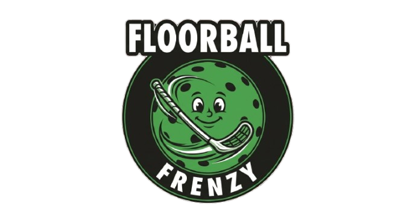

<p align="center">
  
</p>

<p align="center">
  A colourful 3D arcade floorball game built with Godot for mobile, desktop, and the web.
</p>

## About the game

Floorball Frenzy puts the Lambs and Pirates into fast 6v6 matches. Control one player while five AI teammates spread out, mark opponents, pass around the rink, and look for a shot. Play a solo match or host a 1v1 online game where each player leads a full AI-supported team.

### Highlights

- 6v6 arcade floorball with possession, passing, charged slap shots, dashes, parries, and one-touch plays
- Distinct Lambs and Pirates characters, team colours, sticks, and presentation
- Tactical AI formations, marking, support runs, passing, shooting, and goalkeeping
- 1v1 WebRTC multiplayer with five AI teammates per side
- Client prediction, snapshot extrapolation, input reconciliation, and compact binary state packets
- Touch controls and responsive camera framing for mobile and web play
- Optimised Blender-authored stick, player, and hollow floorball assets
- Progressive Web App export and automated Vercel deployment

## Controls

| Action | Keyboard | Touch |
| --- | --- | --- |
| Move | `WASD` or arrow keys | Virtual joystick |
| Shoot | Hold and release `Space` | Hold and release **Shoot** |
| Pass | `E` | **Pass** |
| Dash | `Shift` | Dash control |
| Switch player | `Tab` | **Switch** |

Hold Shoot to wind up, then release to swing. Pass selection favours the closest teammate who is most directly in front of the controlled player.

## Getting started

### Requirements

- [Godot Engine 4.7.2](https://godotengine.org/download/) with web export templates
- A browser with WebGL 2.0 and WebRTC support for web and online play
- Blender 5 only when editing the source models

Clone the repository and open `project.godot` in Godot:

```bash
git clone git@github.com:dylanwatsonsoftware/floorball-frenzy-3d.git
cd floorball-frenzy-3d
godot --editor project.godot
```

Press <kbd>F6</kbd> or <kbd>F5</kbd> in Godot to run the game. The main scene is `scenes/app/main_menu.tscn`.

> [!NOTE]
> The project uses Godot's Compatibility renderer so the same build works across desktop, mobile browsers, and WebGL 2.0 devices.

## Web build

Create the production PWA export with:

```bash
./scripts/export-web
```

The build is written to `build/web`. The script also hardens service-worker updates so new game versions replace stale cached WASM and PCK files reliably.

To package the Vercel Build Output locally:

```bash
./scripts/package-vercel-output
```

Pushes to `main` run the GitHub Actions workflow, export the Godot web build, retain it as an artifact, and deploy it when the Vercel secrets are configured.

## Online matchmaking

Online matches use:

- A small HTTP lobby and signaling service in `server/matchmaking.mjs`
- WebRTC's unordered, unreliably delivered data channel for real-time gameplay
- Host-authoritative simulation with guest-side prediction and reconciliation
- Binary `FFS1` snapshots for players, ball state, possession, score, and timing
- Live frame, ping, jitter, loss, prediction-error, command-acknowledgement, and direct/relay diagnostics
- Portable guest command/snapshot traces: tap the open diagnostics panel to download a replayable JSON capture

Set `REDIS_URL` for persistent, multi-instance production matchmaking. Without it, the server uses an in-memory lobby suitable for local development and tests. ICE server credentials are fetched through `/api/ice-servers`, with public STUN servers as a fallback.

> [!IMPORTANT]
> Online players should run the same deployed build. Snapshot compatibility is maintained across the current `FFS1` protocol, but gameplay behavior can still differ when an old browser tab remains open through a deployment.

## Tests

Tests are lightweight Godot scripts and shell deployment contracts. Run an individual gameplay test with:

```bash
godot --headless --path . --script tests/online_match_scene_test.gd
```

Run the deployment checks with:

```bash
./tests/project_baseline_test.sh
./tests/web_export_config_test.sh
./tests/deployment_pipeline_test.sh
```

Useful focused suites include:

```bash
godot --headless --path . --script tests/ball_interaction_test.gd
godot --headless --path . --script tests/squad_scene_test.gd
godot --headless --path . --script tests/main_menu_test.gd
godot --headless --path . --script tests/online_state_codec_test.gd
```

## Project structure

```text
assets/          Runtime models and UI artwork
art_source/      Editable Blender source files
blender_source/  Combined Blender equipment scene
scenes/          Main menu and match scenes
scripts/
  gameplay/      Player, ball, goalkeeper, and match controllers
  network/       Matchmaking, WebRTC, prediction, and state replication
  presentation/  Arena, camera, menus, HUD, and visual feedback
  simulation/    Testable gameplay rules and AI decisions
server/          Vercel matchmaking and signaling functions
tests/           Gameplay, presentation, networking, and deployment tests
```

The `.blend` files are the editable source of truth for authored equipment. Exported, game-ready GLB files live in `assets/models` and should remain suitable for phone and web rendering budgets.
